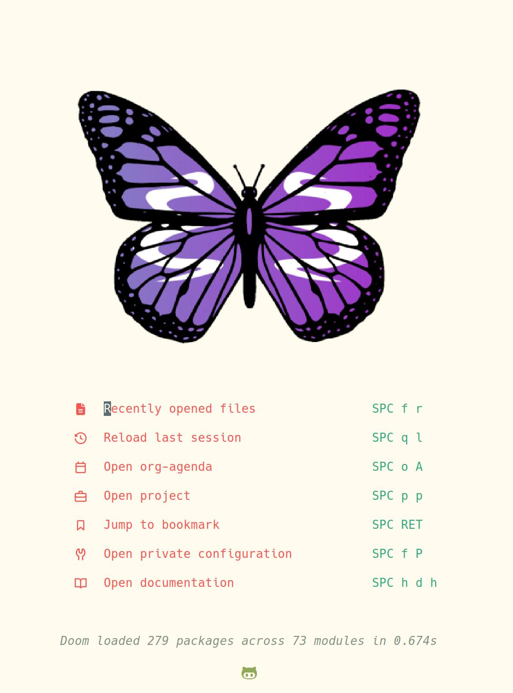
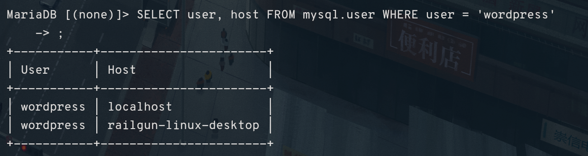
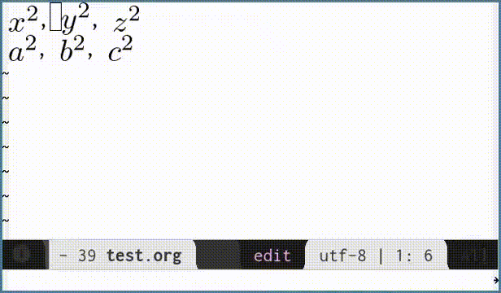
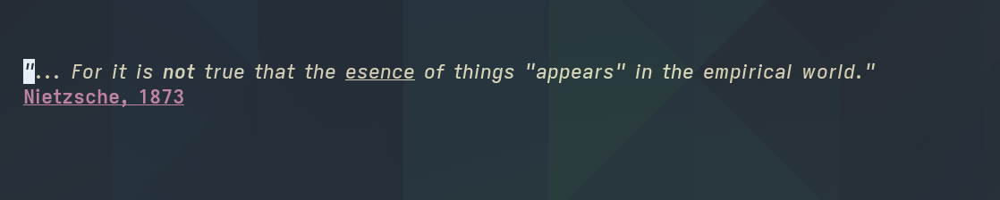

#+TITLE: ⚡RAILGUN DOOM EMACS CONFIG⚡
#+AUTHOR: Railgun_210
:PROPERTIES:
#+OPTIONS: toc:2
#+STARTUP: overview
#+ATTR_ORG: :width 100

#+PROPERTY: header-args :tangle no
:END:
* Config
This is my doom emacs config.
I hope you can find it useful.
Much thanks to Sophie Bosio, so much of this config comes straight out of her Prettyfing Emacs Org Mode guide.
** General Doom Settings
*** Fonts
I use these fonts for everything:
Sans serif font: ~Overpass Nerd Font~
Programming Font: ~Cozette~
#+BEGIN_SRC emacs-lisp :tangle config.el
(setq doom-font (font-spec :family "Cozette" :weight 'medium :height 120)
      doom-big-font (font-spec :family "Overpass Nerd Font" :height 140)
      doom-variable-pitch-font (font-spec :family "Overpass Nerd Font" :height 1.2))
#+END_SRC
*** Themes
I use Everforest hard light most of the time, unless I get sick of it then I just use Doom one.
Right now I'm enjoying doom-nebula-blue. We'll see how long it lasts until I get sick of it too.
#+BEGIN_SRC emacs-lisp :tangle config.el
(setq doom-theme 'doom-nebula-blue)
#+END_SRC
*** Misc Settings
These are really small things I've added that don't exactly fit anywhere else.
#+BEGIN_SRC emacs-lisp :tangle config.el
;; Got tired of seeing line numbers in org mode, but you don't have to set this if you don't care.
(setq display-line-numbers-type t)
;; Set tabs to only 2 everytime you use the '>' key.
(setq evil-shift-width 2)
#+END_SRC
*** Transparency
Looks great with wayland. This sets transparency to 80%, so 80% opaque.
If you want this to work with Xorg, you'll have to configure picom to get the transparency to do anything.
#+BEGIN_SRC emacs-lisp :tangle config.el
(set-frame-parameter nil 'alpha-background 80)
(add-to-list 'default-frame-alist '(alpha-background . 80))
#+end_src
*** Banner
I wanted something pretty to post on unixporn every now and then.
Plus, what better symbol than the butterfly?
If you do this correctly and use git to synchronize everything for your doom emacs, then you can just replace the image in the repo with whatever you want the banner to be.
 -  
#+BEGIN_SRC emacs-lisp :tangle config.el
(setq fancy-splash-image (concat doom-user-dir "M-x_butterfly.png"))
#+END_SRC
** Org Mode Settings
*** Org-mode Default Folder
   This is where all the org notes should be located by default
    #+BEGIN_SRC emacs-lisp :tangle config.el
    (setq org-directory "~/Dropbox/org-notes/")
    #+END_SRC
*** Org Mode Font Settings
    This sets the font for org mode
#+BEGIN_SRC emacs-lisp :tangle config.el
(when (member "Cozette" (font-family-list))
  (set-face-attribute 'default nil :font "Overpass Nerd Font" :height 100)
  (set-face-attribute 'fixed-pitch nil :family "Cozette"))
(when (member "Overpass Nerd Font" (font-family-list))
  (set-face-attribute 'variable-pitch nil :family "Overpass Nerd Font" :height 1.2))
#+END_SRC
*** Org Mode General Settings
**** Bullet Settings
Who doesn't like pretty bullets?
This setup uses org-modern for custom bullets.
#+BEGIN_SRC emacs-lisp :tangle config.el
(after! org
  (global-org-modern-mode)
  (after! org-modern
    (setq org-modern-star '("◉" "○" "◆" "✿")
          org-modern-list '((?+ . "•") (?- . "–") (?* . "◦"))
          org-modern-hide-stars nil)
 
    (setq org-modern-table nil
          org-modern-block-name
          '((t . t)
            ("src" . "⌘")
            ("example" . "»")
            ("quote" . "❝")
            ("export" . "󰈇"))))
#+END_SRC
*** Org Mode Image Download
This is necessary to enable pasting in images into org mode.
+This is built around Flameshot and xclip. If I ever switch to wayland, this will probably break.+
Note: You DID switch to Wayland and this did break. So this is how you fixed it using wl-clipboard:
#+BEGIN_SRC emacs-lisp :tangle config.el
  (require 'org-download)
  (setq org-download-method 'directory
        org-download-image-dir "~/org-notes/.resources"
        org-download-timestamp "org_%Y%m%d-%H%M%S_"
        org-download-heading-lvl nil
        org-image-actual-width 900
        org-download-screenshot-method
        "wl-paste --type image/png > %s")
#+END_SRC
**** Inline Image Settings
This makes it so you don't have to manually load images each time.
  #+BEGIN_SRC emacs-lisp :tangle config.el
  ;; Always display inline images
  (setq org-startup-with-inline-images t)
  ;; Refresh images after executing code blocks or edits
  (add-hook 'org-babel-after-execute-hook #'org-display-inline-images)
  ;; Refresh images when reverting buffers (e.g. after git pull)
  (add-hook 'after-revert-hook #'org-display-inline-images)
#+END_SRC
**** Xournal Settings
I wanted this to make it easier to draw notes directly into org mode and this makes it possible.
It's still not ideal, but there isn't a real better alternative.
  #+BEGIN_SRC emacs-lisp :tangle config.el
  (defun create-png-xournal-file (&optional only-export)
  "Creates a png from a xournal file and inserts it into the buffer."
    (interactive "P")
    (let ((file-name (expand-file-name
                      (file-name-sans-extension
                       (read-file-name ".xopp file to convert: ")))))
      (shell-command (format "xournalpp --create-img=%s.png %s.xopp"
                             file-name file-name))
      (unless only-export
       (kill-new (concat "[[" file-name ".png" "]]"))
       (yank)
       (org-display-inline-images))
      (org-redisplay-inline-images)))
  (require 'org-xopp) (org-xopp-setup)
  #+END_SRC
**** Heading Size and Font Settings
We need to set the size for each heading manually. By default Doom Emacs does them pretty small.
This section also includes fixes to ensure that the fonts display properly.
  #+BEGIN_SRC emacs-lisp :tangle config.el
  (dolist (face '((org-level-1 . 1.30)
                  (org-level-2 . 1.25)
                  (org-level-3 . 1.15)
                  (org-level-4 . 1.05)
                  (org-level-5 . 1.05)
                  (org-level-6 . 1.05)
                  (org-level-7 . 1.05)
                  (org-level-8 . 1.05)))
    (set-face-attribute (car face) nil
                        :font "Overpass Nerd Font"
                        :weight 'bold
                        :height (cdr face)))

  ;; Make the document title bigger
  (set-face-attribute 'org-document-title nil
                      :font "Overpass Nerd Font"
                      :weight 'bold
                      :height 1.1)
  ;; This will fix spacing issues when a line of text contains both variable and fixed-pitch text.
  (require 'org-indent)
  (set-face-attribute 'org-indent nil :inherit '(org-hide fixed-pitch))
  ;; Ensure that some parts of Org will always use fixed-pitch fonts even if variable-pitch-mode is on
  (set-face-attribute 'org-block nil            :foreground nil :inherit
                      'fixed-pitch :height 0.85)
  (set-face-attribute 'org-code nil             :inherit '(shadow fixed-pitch) :height 0.85)
  (set-face-attribute 'org-indent nil           :inherit '(org-hide fixed-pitch) :height 0.85)
  (set-face-attribute 'org-verbatim nil         :inherit '(shadow fixed-pitch) :height 0.85)
  (set-face-attribute 'org-special-keyword nil  :inherit '(font-lock-comment-face
                                                           fixed-pitch))
  (set-face-attribute 'org-meta-line nil        :inherit '(font-lock-comment-face fixed-pitch))
  (set-face-attribute 'org-checkbox nil         :inherit 'fixed-pitch)
  (add-hook 'org-mode-hook 'variable-pitch-mode)
#+END_SRC
**** Latex Settings
We want to use latex for math equations with org mode. It's pretty useful.
#+BEGIN_SRC emacs-lisp :tangle config.el
  ;; enable a live PDF viewer
  (setq +latex-viewers '(pdf-tools))
  (setq org-preview-latex-default-process 'dvisvgm)
  ;; Latex lsp reader
  (setq lsp-tex-server 'digestif)
#+END_SRC
**** Latex Previews
We use the org-fragtog package to make previews for latex a bit nicer.
#+BEGIN_SRC emacs-lisp :tangle config.el
  (add-hook! 'org-mode-hook 'org-fragtog-mode)
  (setq org-startup-with-latex-preview t
        org-format-latex-options (plist-put org-format-latex-options :scale 2.0))
#+END_SRC
**** Appearance Settings
***** Special Latex Characters
This includes allowing you to write a special latex character by just using a backslash,
for example you can use ~\alpha~ to write the greek letter alpha.
#+BEGIN_SRC emacs-lisp :tangle config.el
  (setq org-adapt-indentation t
        org-hide-leading-stars t
        org-pretty-entities t)
#+END_SRC
***** Source Code Blocks
For source code blocks, make Org display the contents using the major mode of the relevant language.
This will also make TAB behave like normal in code blocks, instead of how we want it to behave in Org mode.
#+BEGIN_SRC emacs-lisp :tangle config.el
  ;; For source code blocks, make Org display contents using the major mode of the relevant language.
  ;; This also makes TAB behave like normal in code blocks.
  (setq org-src-fontify-natively t
	org-src-tab-acts-natively t
        org-edit-src-content-indentation 0)
#+END_SRC
***** Emphasis Markers
Markers like / for italics and * for bold are hidden by default, so this make it hard to edit.
By using the org-appear package we can highlight a mark when we have the cursor over them.
#+BEGIN_SRC emacs-lisp :tangle config.el
  (use-package org-appear
    :commands (org-appear-mode)
    :hook     (org-mode . org-appear-mode)
    :config
    (setq org-hide-emphasis-markers t)  ; Must be activated for org-appear to work
    (setq org-appear-autoemphasis   t   ; Show bold, italics, verbatim, etc.
          org-appear-autolinks      t   ; Show links
	  org-appear-autosubmarkers t)) ; Show sub- and superscript
#+END_SRC
***** Todo Headers
Org options to deal with headers and todo's to make them look a little nicer.
#+begin_src emacs-lisp :tangle config.el
  (setq org-log-done                       t
        org-auto-align-tags                t
	org-tags-column                    -80
	org-fold-catch-invisible-edits     'show-and-error
	org-special-ctrl-a/e               t
	org-insert-heading-respect-content t)
#+END_SRC
***** Prettify Symbols
Custom function to make tags and other elements in org mode prettier
  #+BEGIN_SRC emacs-lisp :tangle config.el
  ;; Prettify Symbols 
  (defun my/prettify-symbols-setup ()
    ;; Checkboxes
    (push '("[ ]" . "") prettify-symbols-alist)
    (push '("[X]" . "") prettify-symbols-alist)
    (push '("[-]" . "" ) prettify-symbols-alist)
    
    ;; org-abel
    (push '("#+BEGIN_SRC" . ?≫) prettify-symbols-alist)
    (push '("#+END_SRC" . ?≫) prettify-symbols-alist)
    (push '("#+begin_src" . ?≫) prettify-symbols-alist)
    (push '("#+end_src" . ?≫) prettify-symbols-alist)
    
    (push '("#+BEGIN_QUOTE" . ?❝) prettify-symbols-alist)
    (push '("#+END_QUOTE" . ?❞) prettify-symbols-alist)

    ;; Drawers
    (push '(":PROPERTIES:" . "") prettify-symbols-alist)
    
    ;; Tags
    (push '(":projects:" . "") prettify-symbols-alist)
    (push '(":work:"     . "") prettify-symbols-alist)
    (push '(":inbox:"    . "") prettify-symbols-alist)
    (push '(":task:"     . "") prettify-symbols-alist)
    (push '(":thesis:"   . "") prettify-symbols-alist)
    (push '(":uio:"      . "") prettify-symbols-alist)
    (push '(":emacs:"    . "") prettify-symbols-alist)
    (push '(":learn:"    . "") prettify-symbols-alist)
    (push '(":code:"     . "") prettify-symbols-alist)

    (prettify-symbols-mode))

  (add-hook 'org-mode-hook        #'my/prettify-symbols-setup)
  (add-hook 'org-agenda-mode-hook #'my/prettify-symbols-setup)
#+END_SRC
***** Line Breaks
A few things to make text a bit easier to view in Org mode so that the line breaks are a bit more dynamic.
#+BEGIN_SRC emacs-lisp :tangle config.el
  ;; Makes text fill the screen daptively to make long lines of text adapt to the size of whatever window.
  ;; Breaks lines instead of truncates them
  (add-hook 'org-mode-hook 'visual-line-mode)
  ;; Disable line numbers in org mode
  (add-hook 'org-mode-hook #'doom-disable-line-numbers-h)
#+END_SRC
***** Olivetti
We use Olivetti to create a nicer writing environment and then enable it for org mode and markdown.
#+BEGIN_SRC emacs-lisp :tangle config.el
  (setq olivetti-body-width 100) ;; or a float, like 0.6 for 60% of window width
  (add-hook 'org-mode-hook #'olivetti-mode)
  (add-hook 'markdown-mode-hook #'olivetti-mode))
#+END_SRC
** Spellcheckers
Spell-fu uses aspell under the hood to check words against a dictionary.
If spell-fu highlights every word as misspelled, delete the cache at =~/.config/emacs/.local/etc/spell-fu/=.
 - You can spellcheck a word by using =z ===.
 - You can add words to your personal dictionary using =z g=.
#+BEGIN_SRC emacs-lisp :tangle config.el
(after! ispell
  (setq ispell-program-name "aspell"
        ispell-dictionary "en"
        ispell-personal-dictionary (concat doom-user-dir "personal-dict.txt")))

(after! spell-fu
  (setq spell-fu-idle-delay 0.5)
  (set-face-attribute 'spell-fu-incorrect-face nil
                      :foreground nil
                      :background nil
                      :underline '(:style wave :color "goldenrod")))
#+END_SRC
*** TODO Fix the spellchecker so it changes with the language, properly
SCHEDULED: <2026-02-20 Fri>
** Window Settings
We use this to provide gaps between multiple windows. This is the closest I could get to a proper i3 style look,
If you have a better version of this, I'm interested.

Common Window Navigation Hotkeys
- Split Vertically: ~SPC w v~
- Split Horizontally: ~SPC w s~
- Switch Windows: ~SPC w w~ (cycle) or ~SPC w <h/j/k/l>~ (directional)
- Close Current Window: ~SPC w c~ or ~SPC w q~
- Close Other Windows: ~SPC w o~ (maximize current)

Moving and Resizing
- Move Window Location: ~SPC w H/J/K/L~ (shift current window left/down/up/right)
- Balance Sizes: ~SPC w =~
- Increase/Decrease Height: ~SPC w +~ / ~SPC w -~
- Increase/Decrease Width: ~SPC w >~ / ~SPC w <~
  
#+BEGIN_SRC emacs-lisp :tangle config.el
;; Make dividers appear even if only one window is present
(setq window-divider-default-places t)
;; Enable window-divider globally
(window-divider-mode 1)
;; Gap width (like i3 inner gaps)
(setq window-divider-default-bottom-width 10
      window-divider-default-right-width 10
      window-divider-default-places t)
#+END_SRC
** Alerts
*** TODO Fix this section so that you get alerts whenever a todo item gets close it's time on your desktop
SCHEDULED: <2026-02-15 2200>
#+BEGIN_SRC emacs-lisp :tangle config.el
#+END_SRC 
** Org Agenda
   Org agenda is kinda complicated. We essentially only want to read from two files, =agenda.org= and =todoist.org=. My idea is =agenda.org= covers regular events I want on the calendar, and =todoist.org= will cover todo lists. I want to place all my agenda files in one folder so if I want to make a separate agenda I can.
   #+BEGIN_SRC emacs-lisp :tangle config.el
   (after! org
     (setq org-directory "~/org-notes/"
           org-agenda-files
           '("~/Dropbox/org-notes/")))
   #+END_SRC
** Dashboard
Use this to add whatever section you want to the Doom Dashboard
#+BEGIN_SRC emacs-lisp :tangle config.el
(setq +doom-dashboard-menu-sections
'(("Recently opened files" :icon
   (nerd-icons-faicon "nf-fa-file_text" :face 'doom-dashboard-menu-title)
   :action recentf-open-files)
  ("Reload last session" :icon
   (nerd-icons-octicon "nf-oct-history" :face 'doom-dashboard-menu-title)
   :when
   (cond
    ((modulep! :ui workspaces)
     (file-exists-p
      (expand-file-name persp-auto-save-fname persp-save-dir)))
    ((require 'desktop nil t)
     (file-exists-p
      (desktop-full-file-name))))
   :action doom/quickload-session)
  ("Open org-agenda" :icon
   (nerd-icons-octicon "nf-oct-calendar" :face 'doom-dashboard-menu-title)
   :when
   (fboundp 'org-agenda)
   :action org-agenda)
  ("Open project" :icon
   (nerd-icons-octicon "nf-oct-briefcase" :face 'doom-dashboard-menu-title)
   :action projectile-switch-project)
  ("Jump to bookmark" :icon
   (nerd-icons-octicon "nf-oct-bookmark" :face 'doom-dashboard-menu-title)
   :action bookmark-jump)
  ("Open private configuration" :icon
   (nerd-icons-octicon "nf-oct-tools" :face 'doom-dashboard-menu-title)
   :when
   (file-directory-p doom-user-dir)
   :action doom/open-private-config)
  ("Open documentation" :icon
   (nerd-icons-octicon "nf-oct-book" :face 'doom-dashboard-menu-title)
   :action doom/help)))
#+END_SRC
** Tramp
- These settings all come from Core Dumped article, [[https://coredumped.dev/2025/06/18/making-tramp-go-brrrr./][Making TRAMP go Brrrr….]].
*** Php TRAMP Settings
- These settings are what you need to get intelephense to work as as an lsp with php.
- You have to have intelephense installed on your destination machine you're trying to work with.
- I installed it to ~~/.npm-global~ and made that my default global path for npm in order to get this to work.
- If you're trying to get this working then utilize the buffers to read the error messages. You can search buffers by using the command =consult buffer= : =SPC b B=
#+BEGIN_SRC emacs-lisp :tangle config.el
(after! lsp-php
  ;; Disable other PHP LSPs over TRAMP
  (setq lsp-disabled-clients
        '(iph-tramp phpactor-tramp serenata-tramp php-ls-tramp semgrep-ls-tramp))

  (lsp-register-client
   (make-lsp-client
    :new-connection
    (lsp-tramp-connection
     '("/home/railgun/.npm-global/bin/intelephense" "--stdio"))
    :major-modes '(php-mode)
    :remote? t
    :priority 10
    :server-id 'intelephense-remote)))

(after! tramp
  ;; Keep PATH minimal to avoid TRAMP slowdowns
  (setq tramp-remote-path
        '("/home/railgun/.npm-global/bin"
          "/usr/bin"
          "/usr/local/bin"
          tramp-own-remote-path)))
#+END_SRC
*** File Watching Fixes
- This is specifically for the problem of when using  a project with a ton of files remotely, the LSP can get bogged down trying to file watch too many files.
- We disable file watching globally for LSPs and then specifically disable it for TRAMP connections.
- We then set the threshold for 100 as what counts as too many files.
- Last we set =lsp-remote-path-check= to nill to avoid expensive local/remote validation with binaries.
#+BEGIN_SRC emacs-lisp :tangle config.el
(after! lsp-mode
  (setq lsp-enable-file-watchers nil)
  (setq lsp-file-watch-threshold 500)) ; Lower the threshold for what counts as "too many files")
(setq lsp-remote-path-check nil)
#+END_SRC
*** Fix Remote Compile
- This Allows TRAMP to use SSH connection sharing for faster connections.
- The =compile= command disables this feature so we have to manually turn it back on here.
#+BEGIN_SRC emacs-lisp :tangle config.el
(with-eval-after-load 'tramp
  (with-eval-after-load 'compile
    (remove-hook 'compilation-mode-hook #'tramp-compile-disable-ssh-controlmaster-options)))
#+END_SRC
*** Debugging Performance Issues
- You can debug by using =M-x profiler-start= before behavior gets slow.
- Use =M-x profiler-stop= and =M-x profiler-report= after that to get a list of where Emacs was spending it's time.
- If TRAMP was the problem you'll see =tramp-wait-for-output= was taking a majority of the time.
- You can use =debug-on-entry= on the =tramp-send-command= to help backtrace when something calls out to TRAMP slowing it down
- Below includes fixes to the doom-modeline that could cause a slowdown based on the above debugging. 
  #+BEGIN_SRC emacs-lisp tangle config.el
(remove-hook 'evil-insert-state-exit-hook #'doom-modeline-update-buffer-file-name)
(remove-hook 'find-file-hook #'doom-modeline-update-buffer-file-name)
(remove-hook 'find-file-hook 'forge-bug-reference-setup)
  #+END_SRC
*** Magit
- Magit is slower over TRAMP significantly so we need help improving it's performance.
- General tip is to use =magit-dispatch= and =magit-file-dispatch= instead of doing everything from the status buffer to load and refresh each time. Only use the status buffer when you need to get a high-level view of your repo or to operate on a large amount of files at once.
- Use the shell commands more often for =git branch= or =git commit= commands but use magit for cherry-picking or rebasing.
- don't show the diff by default in the commit buffer. Use `C-c C-d' to display it
#+BEGIN_SRC emacs-lisp :tangle config.el
(setq magit-commit-show-diff nil)
;; don't show git variables in magit branch
(setq magit-branch-direct-configure nil)
;; don't automatically refresh the status buffer after running a git command
(setq magit-refresh-status-buffer nil)
#+END_SRC
*** Caching Improvements
- Sending calls over TRAMP is expensive, so it's better to not do it.
- TRAMP has some built-in caching for remote files, but it only keeps them for a short while.
- This function is used to cache things that we don't want TRAMP to look up all the time.
#+BEGIN_SRC emacs-lisp :tangle config.el
(defun memoize-remote (key cache orig-fn &rest args)
  "Memoize a value if the key is a remote path."
  (if (and key
           (file-remote-p key))
      (if-let ((current (assoc key (symbol-value cache))))
          (cdr current)
        (let ((current (apply orig-fn args)))
          (set cache (cons (cons key current) (symbol-value cache)))
          current))
    (apply orig-fn args)))
#+end_src
- The below applies the previously created function
  #+BEGIN_SRC emacs-lisp :tangle config.el
;; Memoize current project
(defvar project-current-cache nil)
(defun memoize-project-current (orig &optional prompt directory)
  (memoize-remote (or directory
                       project-current-directory-override
                       default-directory)
                   'project-current-cache orig prompt directory))

(advice-add 'project-current :around #'memoize-project-current)

;; Memoize magit top level
(defvar magit-toplevel-cache nil)
(defun memoize-magit-toplevel (orig &optional directory)
  (memoize-remote (or directory default-directory)
                   'magit-toplevel-cache orig directory))
(advice-add 'magit-toplevel :around #'memoize-magit-toplevel)

;; memoize vc-git-root
(defvar vc-git-root-cache nil)
(defun memoize-vc-git-root (orig file)
  (let ((value (memoize-remote (file-name-directory file) 'vc-git-root-cache orig file)))
    ;; sometimes vc-git-root returns nil even when there is a root there
    (when (null (cdr (car vc-git-root-cache)))
      (setq vc-git-root-cache (cdr vc-git-root-cache)))
    value))
(advice-add 'vc-git-root :around #'memoize-vc-git-root)

;; memoize all git candidates in the current project
(defvar $counsel-git-cands-cache nil)
(defun $memoize-counsel-git-cands (orig dir)
  ($memoize-remote (magit-toplevel dir) '$counsel-git-cands-cache orig dir))
(advice-add 'counsel-git-cands :around #'$memoize-counsel-git-cands)
  #+END_SRC
** Eww
The idea of this is to force eww to stay open all the time instead of popping-up and disappearing right after.
#+BEGIN_SRC emacs-lisp :tangle config.el
(after! eww
  (add-to-list 'display-buffer-alist
               '("\\*eww\\*"
                 (display-buffer-reuse-window
                  display-buffer-pop-up-window))))
#+END_SRC
** Programming
*** SQL
    - This connects to a remote SQL db on the Raspberry Pi.
    - Tips to get this working:
      - Enable the port using ufw.
        - ~sudo ufw allow 3306/tcp~
        - Then check if the port is active using ~sudo ufw status~
      - Change the SQL config to allow connections from a remote host
        - ~grep -E "port|bind-address" /etc/mysql/mariadb.conf.d/50-server.cnf~
        - If the output says ~127.0.0.1~ you'll have to use the ~#~ to hide that line so you can connect from more than just the local host.
      - Create a new user with your hostname that can access SQL.
      #+BEGIN_SRC sql :tangle no
              GRANT ALL PRIVILEGES ON wordpress.* TO 'wordpress'@'railgun-linux-desktop' IDENTIFIED BY '<password>';
              FLUSH PRIVILEGES;
      #+END_SRC
    - This is what the result should be if you check to make sure the user was created:
      - 
    - You can then type the settings in here to connect to whatever you need to:
    #+BEGIN_SRC emacs-lisp :tangle config.el
(setq sql-connection-alist
      '((my-remote-db
         (sql-product 'mysql)
         (sql-port 3306)                   ; 5432 for Postgres, 3306 for MySQL
         (sql-server "192.168.50.179")
         (sql-user "wordpress")
         (sql-database "wordpress"))))
    #+end_src
** Debugging
#+BEGIN_SRC emacs-lisp :tangle config.el
 (defun profiler-report-expand-all ()
   "Expand all entries in the profiler report recursively."
   (interactive)
   (thread-last
     (buffer-list)
     (seq-filter
      (lambda (b)
        (string-match-p
         "\\*\\(CPU\\|Memory\\)-Profiler-Report.*\\*"
         (buffer-name b))))
     (seq-do
      (lambda (b)
        (with-current-buffer b
          (goto-char (point-min))
          (while (not (eobp))
            (profiler-report-expand-entry)
            (profiler-report-next-entry))
          (goto-char (point-min)))))))

 (add-hook! 'profiler-report-mode-hook
   (run-with-timer
    0.1 nil
    #'profiler-report-expand-all))

(defadvice! helpful-for-describe-function-a (_fn &rest args)
    "Replace describe-function with better alternative.
Works in the Profiler and Transients."
    :around #'describe-function
    (apply #'helpful-symbol args))
#+END_SRC
** Hotkeys
We save all the hotkeys here so they're in one place.
I really prefer leader key hotkeys for Emacs over using Control or Win key.
Be careful when you're messing with this so you don't overwrite the default hotkeys.

Custom Hotkeys
- Doom Dashboard Open: ~SPC x h~
- Paste in screenshot: ~SPC m c p~
- Insert Xournal figure: ~SPC m c x~
- Display all inline images: ~SPC m d i~

  Common Hotkeys:
- Increase text size: ~C-x C-+~
Handling Buffers
- Switch to a dedicated buffer AKA org-edit-special to get better editing of org mode code blocks by using : ~SPC m '~
  - While you're in a dedicated buffer you can save using: ~C-c C-c~
  - You can abort from the buffer using: ~C-c C-k~
- Switch to a previous buffer, very useful when working on something and then wanting to go back: ~SPC b p~
    
Magit Common Hotkeys
I use magit all the time and there's way too many hotkeys to memorize even though they're very useful.
- Magit log buffer file: ~SPC g L~
  - Use this to see how commits affect only the current file and it will follow re-names of that file.
- Quit Magit buffer: ~Z Q~
- Magit Double Buffer workflow 
  - 
#+BEGIN_SRC emacs-lisp :tangle config.el
(map! :leader
      ;; Home / Dashboard
      ;; Ewww
      (:prefix-map ("e" . "eww")
        :desc "Reload website" "r" #'eww-reload)
      ;; Dired File Management
      (:prefix-map ("f" . "file")
       :desc "Create directory" "+" #'dired-create-directory
       :desc "Rename directory" "n" #'dired-rename-subdir
       :desc "Create file" "t" #'dired-create-files
       :desc "Mark Directory" "x" #'dired-mark)
      (:prefix-map ("x" . "home")
       :desc "Switch to dashboard" "h" #'+doom-dashboard/open)
      ;; Org mode
      (:prefix-map ("m" . "org")
       ;; Capture / insert
       (:prefix ("c" . "capture")
        :desc "Paste org screenshot" "p" #'org-download-screenshot
        :desc "Insert Xournal figure" "x" #'org-xopp-new-figure)
       ;; Display / visuals
       (:prefix ("d" . "display")
        :desc "Display inline images" "i" #'org-display-inline-images)))
#+END_SRC
* Packages
** Introduction
This is my doom emacs packages config.
It's slightly edited for Mac compared to my general linux config.
#+BEGIN_SRC emacs-lisp :tangle packages.el
;; -*- no-byte-compile: t; -*-
;;; $DOOMDIR/packages.el
#+END_SRC
** Themes
I can't quit Everforest
#+BEGIN_SRC emacs-lisp :tangle packages.el
(package! everforest :recipe (:repo "https://github.com/theorytoe/everforest-emacs.git") :pin "ba61a881b5d57810eef76baae01c951d1e6c2ceb")
#+END_SRC
** Programming
*** phpstan
#+BEGIN_SRC emacs-lisp :tangle packages.el
(package! phpstan
  :recipe (:host github
           :repo "emacs-php/phpstan.el"))
#+END_SRC
** Org Mode Packages
*** Olivetti
Creates a nicer writing environment for Org mode by shifting everything to the right slightly. 
#+BEGIN_SRC emacs-lisp :tangle packages.el
(package! olivetti)
#+END_SRC
*** Fragtog
Support in-line previews of Latex code

#+BEGIN_SRC emacs-lisp :tangle packages.el
(package! org-fragtog)
#+END_SRC
*** Org-appear
Enables automatic visibility toggling depending on cursor position. Hidden element parts appear when the cursor enters an element and disappear when it leaves.

#+BEGIN_SRC emacs-lisp :tangle packages.el
(package! org-appear)
#+end_src
*** Org-download
Make it easier to paste screenshots into org mode.
#+BEGIN_SRC emacs-lisp :tangle packages.el
(package! org-download)
#+END_SRC
*** Org-modern
Used to make all the headers prettier in org mode
#+BEGIN_SRC emacs-lisp :tangle packages.el
(package! org-modern)
#+END_SRC
*** Org-xopp
Provides Xournal++ support for Doom Emacs
#+BEGIN_SRC emacs-lisp :tangle packages.el
(package! org-xopp
:recipe (:host github :repo "mahmoodsh36/org-xopp"
:files (:defaults "*.sh")))
#+END_SRC
*** Tools
* Init
  This is my literate version of =init.el= for Doom Emacs. Hopefully helps you if you're trying to setup the same things as I did. Mine is more tailored for development and school, so YMMV.
  Note: I have all the code in the headers to show what I'm configuring, and I have the actual tangled init.el at the bottom. I am aware that doing this is somewhat psychotic. Let me be crazy.  
** Input
No specialized input or layout modules are enabled here. I just stick with standard evil mode.
#+begin_src emacs-lisp :tangle no
       :input
       ;;bidi              ; (tfel ot) thgir etirw uoy gnipleh
       ;;chinese
       ;;japanese
       ;;layout            ; auie,ctsrnm is the superior home row
#+end_src
** Completion
I use Company, Corfu, Ivy, and Vertico for in-buffer completion.
#+begin_src emacs-lisp :tangle no
       :completion
       ;;company           ; the ultimate code completion backend
       (corfu +orderless)  ; complete with cap(f), cape and a flying feather!
       ;;helm              ; the *other* search engine for love and life
       ;;ido               ; the other *other* search engine...
       ;;ivy               ; a search engine for love and life
       vertico           ; the search engine of the future
#+end_src
** User Interface
Look and feel of Doom Emacs. Nothing too special. Be careful what you enable because you can get conflicts.
#+begin_src emacs-lisp :tangle no
       :ui
       ;;deft              ; notational velocity for Emacs
       doom              ; what makes DOOM look the way it does
       doom-dashboard    ; a nifty splash screen for Emacs
       doom-quit         ; DOOM quit-message prompts when you quit Emacs
       (emoji +unicode)  ; 🙂
       ;;indent-guides     ; highlighted indent columns
       ligatures         ; ligatures and symbols to make your code pretty again
       ;;minimap           ; show a map of the code on the side
       modeline          ; snazzy, Atom-inspired modeline, plus API
       ;;nav-flash         ; blink cursor line after big motions
       neotree           ; a project drawer, like NERDTree for vim
       ophints           ; highlight the region an operation acts on
       (popup +defaults)   ; tame sudden yet inevitable temporary windows
       smooth-scroll     ; So smooth you won't believe it's not butter
       tabs              ; a tab bar for Emacs
       treemacs          ; a project drawer, like neotree but cooler
       unicode           ; extended unicode support for various languages
       (vc-gutter +pretty) ; vcs diff in the fringe
       vi-tilde-fringe   ; fringe tildes to mark beyond EOB
       window-select     ; visually switch windows
       workspaces        ; tab emulation, persistence & separate workspaces
       ;;zen               ; distraction-free coding or writing
#+end_src
** Editor Behavior
  Evil mode is enabled everywhere, and I use folding and word-wrap to help manage large files. (How is anyone managing org mode without them tbh)
#+begin_src emacs-lisp :tangle no
       :editor
       (evil +everywhere); come to the dark side, we have cookies
       file-templates    ; auto-snippets for empty files
       fold              ; (nigh) universal code folding
       (format +onsave)  ; automated prettiness
       ;;god               ; run Emacs commands without modifier keys
       ;;lispy             ; vim for lisp, for people who don't like vim
       ;;multiple-cursors  ; editing in many places at once
       ;;objed             ; text object editing for the innocent
       ;;parinfer          ; turn lisp into python, sort of
       ;;rotate-text       ; cycle region at point between text candidates
       snippets          ; my elves. They type so I don't have to
       word-wrap         ; soft wrapping with language-aware indent
#+end_src
** Core Emacs
Modules that enhance the basic emacs experience.
#+begin_src emacs-lisp :tangle no
       :emacs
       dired             ; making dired pretty [functional]
       electric          ; smarter, keyword-based electric-indent
       eww               ; the internet is gross
       ;;ibuffer           ; interactive buffer management
       undo              ; persistent, smarter undo for your inevitable mistakes
       vc                ; version-control and Emacs, sitting in a tree
#+end_src
** Terminals
I just enable every shell possible. You're mostly going to use vterm though.
#+begin_src emacs-lisp :tangle no
       :term
       eshell            ; the elisp shell that works everywhere
       shell             ; simple shell REPL for Emacs
       term              ; basic terminal emulator for Emacs
       vterm             ; the best terminal emulation in Emacs
#+end_src
** Checkers
Spell checking and grammar checking.
#+begin_src emacs-lisp :tangle no
       :checkers
       syntax              ; tasing you for every semicolon you forget
       (spell +aspell) ; tasing you for misspelling mispelling
       ;;grammar           ; tasing grammar mistake every you make
#+end_src
** Tools
Covers development, debugging, documentation, and infrastructure tool-kits.
#+begin_src emacs-lisp :tangle no
       :tools
       ;;ansible
       ;;biblio            ; Writes a PhD for you (citation needed)
       ;;collab            ; buffers with friends
       debugger          ; FIXME stepping through code, to help you add bugs
       ;;direnv
       docker
       editorconfig      ; let someone else argue about tabs vs spaces
       ein               ; tame Jupyter notebooks with emacs
       (eval +overlay)     ; run code, run (also, repls)
       lookup              ; navigate your code and its documentation
       lsp               ; M-x vscode
       magit             ; a git porcelain for Emacs
       make              ; run make tasks from Emacs
       pass              ; password manager for nerds
       pdf               ; pdf enhancements
       ;;terraform         ; infrastructure as code
       tmux              ; an API for interacting with tmux
       ;;tree-sitter       ; syntax and parsing, sitting in a tree...
       upload            ; map local to remote projects via ssh/ftp
#+end_src
** Operating System Integration
MacOS-specific tweaks are enabled if this is running on that platform.
#+begin_src emacs-lisp :tangle no
:os
(:if (featurep :system 'macos) macos)
#+end_src
** Programming Languages
I might be a bit overambitious with all the programming languages enabled here.
#+begin_src emacs-lisp :tangle no
       :lang
       ;;agda              ; types of types of types of types...
       ;;beancount         ; mind the GAAP
       ;;(cc +lsp)         ; C > C++ == 1
       ;;clojure           ; java with a lisp
       ;;common-lisp       ; if you've seen one lisp, you've seen them all
       ;;coq               ; proofs-as-programs
       ;;crystal           ; ruby at the speed of c
       ;;csharp            ; unity, .NET, and mono shenanigans
       ;;data              ; config/data formats
       ;;(dart +flutter)   ; paint ui and not much else
       ;;dhall
       ;;elixir            ; erlang done right
       ;;elm               ; care for a cup of TEA?
       emacs-lisp        ; drown in parentheses
       ;;erlang            ; an elegant language for a more civilized age
       ;;ess               ; emacs speaks statistics
       ;;factor
       ;;faust             ; dsp, but you get to keep your soul
       ;;fortran           ; in FORTRAN, GOD is REAL (unless declared INTEGER)
       ;;fsharp            ; ML stands for Microsoft's Language
       ;;fstar             ; (dependent) types and (monadic) effects and Z3
       ;;gdscript          ; the language you waited for
       ;;(go +lsp)         ; the hipster dialect
       ;;(graphql +lsp)    ; Give queries a REST
       (haskell +lsp)    ; a language that's lazier than I am
       ;;hy                ; readability of scheme w/ speed of python
       ;;idris             ; a language you can depend on
       json              ; At least it ain't XML
       (java +lsp)       ; the poster child for carpal tunnel syndrome
       javascript        ; all(hope(abandon(ye(who(enter(here))))))
       kotlin              ; a better, slicker Java(Script)
       (latex +cdlatex +latexmk +lsp)    ; writing papers in Emacs has never been so fun
       lua               ; one-based indices? one-based indices
       markdown          ; writing docs for people to ignore
       (nix +lsp)               ; I hereby declare "nix geht mehr!"
       (org +pretty +download)               ; organize your plain life in plain text
       php               ; perl's insecure younger brother
       python            ; beautiful is better than ugly
       qt                ; the 'cutest' gui framework ever
       (ruby +rails)     ; 1.step {|i| p "Ruby is #{i.even? ? 'love' : 'life'}"}
       (rust +lsp)       ; Fe2O3.unwrap().unwrap().unwrap().unwrap()
      sh                ; she sells {ba,z,fi}sh shells on the C xor
       web               ; the tubes
       yaml              ; JSON, but readable
#+end_src
** Email
Email is surprisingly contentious if it's worth using it in Doom Emacs or not. I've tried it an earlier version, and I just don't think it's worth the trouble compared to using a regular desktop app. MacOS has plenty and there's very good Linux options like Evolution, Kmail, and Thunderbird.
** Applications
  Extra apps for Emacs. I keep calendar, IRC, and RSS on with my desktop, but I don't care for my laptop.
#+begin_src emacs-lisp :tangle no
       :app
       calendar
       ;;emms
       ;;everywhere        ; *leave* Emacs!? You must be joking
       irc               ; how neckbeards socialize
       (rss +org)        ; emacs as an RSS reader
#+end_src
** Configuration Style
Covers literate configs. I'm a big fan of them if you haven't noticed by now.
#+begin_src emacs-lisp :tangle no
       :config
       literate         ; Now you can use org to make el!
       (default +bindings +smartparens))
#+end_src
** Tangled init.el
#+begin_src emacs-lisp :tangle init.el
(doom!
 :input
 ;;bidi
 ;;chinese
 ;;japanese
 ;;layout

 :completion
 company
 (corfu +orderless)
 ;;helm
 ;;ido
 ivy
 vertico

 :ui
 ;;deft
 doom
 doom-dashboard
 doom-quit
 (emoji +unicode)
 ;;indent-guides
 ligatures
 ;;minimap
 modeline
 ;;nav-flash
 neotree
 ophints
 (popup +defaults)
 smooth-scroll
 tabs
 treemacs
 unicode
 (vc-gutter +pretty)
 vi-tilde-fringe
 window-select
 workspaces
 ;;zen

 :editor
 (evil +everywhere)
 file-templates
 fold
 (format +onsave)
 snippets
 word-wrap

 :emacs
 dired
 electric
 eww
 undo
 vc

 :term
 eshell
 shell
 term
 vterm

 :checkers
 syntax
 (spell +aspell)

 :tools
 debugger
 docker
 editorconfig
 ein
 (eval +overlay)
 lookup
 lsp
 magit
 make
 pass
 pdf
 tmux
 upload

 :os
 (:if (featurep :system 'macos) macos)

 :lang
 emacs-lisp
 (haskell +lsp)
 json
 (java +lsp)
 javascript
 kotlin
 (latex +cdlatex +latexmk +lsp)
 lua
 markdown
 (nix +lsp)
 (org +pretty +download)
 (php +lsp)
 python
 qt
 (ruby +rails)
 (rust +lsp)
 sh
 web
 yaml

 :email
 ;;(mu4e +org +gmail)

 :app
 calendar
 irc
 (rss +org)

 :config
 literate
 (default +bindings +smartparens))
#+end_src
